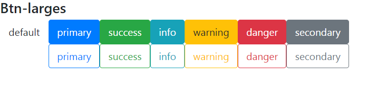
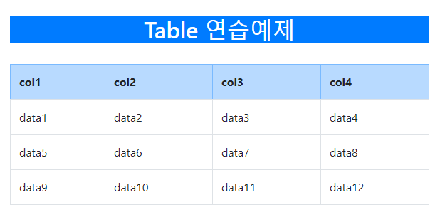

## 2019년 10월 25일

#### Class

- class 에 관한 공부 및 실습.
- import시 특히 주의할것. default클래스는 중괄호에 넣으면 안됨.
- innerClass가 가능한지는 모르겠음

#### Component

1. Bootstrap 적용
   - index.html에 기본적인 부트스트랩 연동.
2. Button
   - 메소드로 버튼을 만든 뒤 잘 작동하는지 확인. 해당 메소드(buttonEXE)엔 버튼에 들어갈 클래스와 띄울 이름 이 두가지가 parameter.
   - 이 과정에서 최종적으로 하나의 div에 감싸져야 에러가 나지 않음을 알게됨.
   - 또한 다수의 변수나 메소드를 호출할 경우 php나 JAVA에서의 문자열 방식이 아닌 jstl과 비슷하게 html코드 사이에 중괄호 안에다 값을 넣는 식이어야함을 알게됨(이론적으론 알고 있었으나 실제로 써보니 바로 와닿지 않았음)
   - 결과적으로 아래의 모습의 버튼들을 화면에 보임.
   
   - 즉, **html코드를 리턴하되 변수, 메소드를 넣을시는 따로 처리**해야함.
3. Table
   - container-panel로 이어지는 평범한 테이블.
   - 추후에 데이터를 받아 뿌리는 형태로 만들 예정이나 현재는 그냥 샘플.
   - 학습 과정에서 html과 달리 CSS부분은 style = "내용"이 아니라 style = {{내용}}으로 써야하는걸 깨달음.
   - 또한 const를 전역변수처럼 선언해서 내용에 css를 채우는 방식으로 CSS역시 사용할 수 있음을 알게됨.
   - 아래가 샘플 테이블

   - 테이블을 중심으로 컴포넌트들을 더 편리하게 만들기 위해 먼저 리스트형 게시판 형태로 만들 예정
   - 다음번엔 array와 데이터를 받고 빼와서 table로 보여주는 연습을 할 예정 

앞으로 참조할 블로그 : https://brunch.co.kr/@brunch92ny/35

