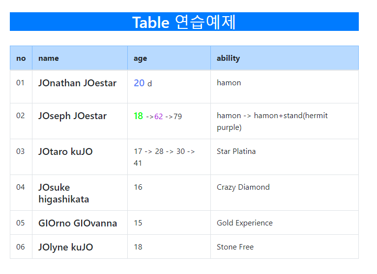
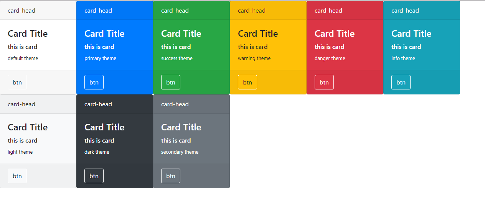

## 20191027

- 메소드 관련
  - 클래스로 나눈뒤 static 함수로 바꿔서 넣음
  - div관련 메소드도 따로 만듦
  - jsx에서 static 함수는 JAVA와 달리 클래스내에서 쓸때도 this.를 써야함.(허용이 아닌 의무)
  - 클래스의 필드에 변수를 선언하든 메소드를 만들든 같은 지역에 선언된 변수등이 아닌이상 this 든 클래스명이든 앞에 붙어야함.
- Array관련
  - 배열의 경우 직접적인 으로 내부값을 수정해선 안됨.
  - 따라서 concat, slice, map, filter 등의 새로운 배열을 만들어내는 함수를 사용해야함.(리액트는 **불변성이 유지되어야 필요한 상황에 리렌더링 되도록 설계가능하고 이렇게 해야 나중에 성능도 최적화 될 수 있기 때문**)
  - 배열 사용법 자체는 js와 동일하나, 데이터를 쓸때는 Json 방식을 따름. 

- 테이블에 응용
  - Array에 JSON형태로 데이터를 넣은 후 출력해보는 방식으로 실습.
  - Array를 아래와 같이 테이블에 뿌림.
  
- 기타
  - card도 실습 및 array로 출력.(table과는 별도)
  
  - 가장 주의해야 할건 static으로 하건 뭘로 하건 어느 클래스의 함수인지 표기하고 이것에 시간 낭비하지 말것.

- 차후계획
  - 하나씩 컴포넌트를 만들고 array를 중점으로 학습. 데이터를 받아서 화면단에 어떻게 보여주고 어떤걸 어떻게 써야 더 편리한지 고민.
  - JSX문법에서 아직 모르는 점이 많으니 여러가지로 숙지하고 익숙해질때까지 노가다.
  - 다음 컴포넌트는 modal창 생각중.
  - 기본적인 부트스트랩 컴포넌트와 문법학습후엔 bootbox와 smoothness 학습.